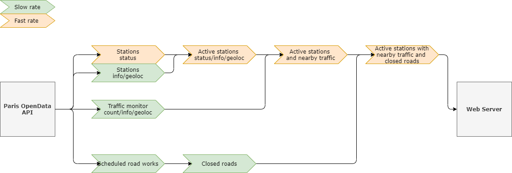

# Velib streaming

A java project using Kafka to display the current status of Paris Velib (bicycles) stations.

## Description

Using the Paris' [OpenData AP](https://opendata.paris.fr/) as its source, this application use a Kafka pipeline to rank the Velib stations by their nearby traffic (using the counters in the city). It also collect the current road works near to each station. The aggregated data is displayed in a simple web application.

Four dataset are used :
* [velib-disponibilite-en-temps-reel](https://opendata.paris.fr/explore/dataset/velib-disponibilite-en-temps-reel) : the current (near real time) status of each station (available bicycles of each type, status of the station, ...)
* [velib-emplacement-des-stations](https://opendata.paris.fr/explore/dataset/velib-emplacement-des-stations) : each station caracteristics (name, geoloc, ...)
* [comptage-velo-donnees-compteurs](https://opendata.paris.fr/explore/dataset/comptage-velo-donnees-compteurs) : the daily number of bicycle counted by each existing monitoring site for the past 13 months
* [chantiers-perturbants](https://opendata.paris.fr/explore/dataset/chantiers-perturbants) : the past/present/future road works

## Prerequisites

* Docker for setting up the local env
* Java SDK (>=11) to run the application

## Running

TODO

## License

This project is licensed under the MIT License - see the [LICENSE.md](LICENSE.md) file for details

## Acknowledgments

* This project was inspired by Udacity's Datastreaming course.
