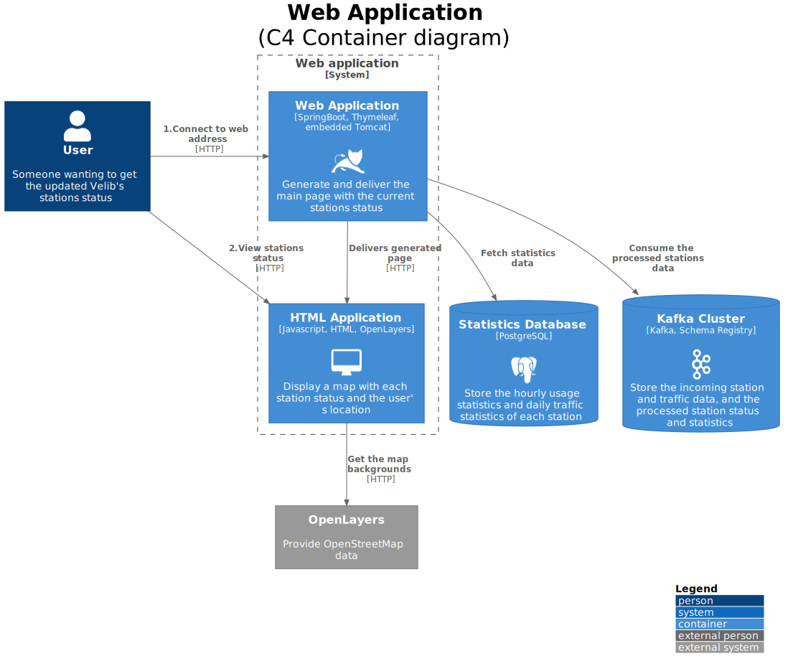
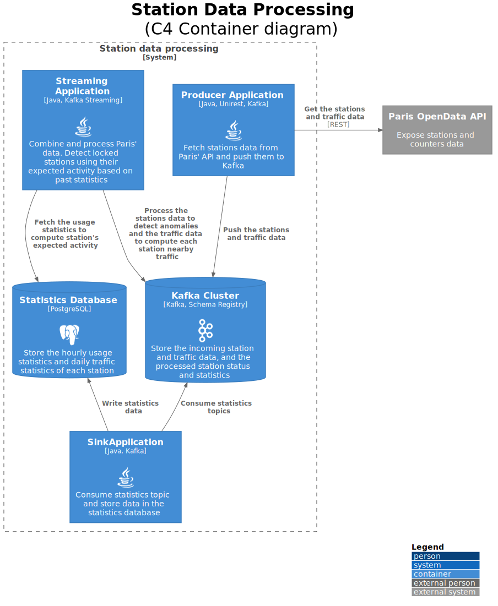

# Velinfo

A java project using Kafka to process the Paris' Velib (bicycles) stations and diplay them using OpenLayers. 

Velib official station status is lacking and often does not report stations or slots that can be locked for several hours. This application try to estimate those.
Additionally, Paris has set up several bicycle traffic counters in the city. The data from this counter is used to provide a nearby traffic estimate for each station. 

## High level architecture

Using the Paris' [OpenData API](https://opendata.paris.fr/) as its source, a Kafka pipeline compute each Velib station status (locked bikes/slots/stations) and join the nearby bicycle counters data.
The aggregated data is consumed and exposed using a Spring Boot web application, serving a simple web page displaying the station (and their data) on a map using OpenLayers.

Two dataset are used :
* [velib-disponibilite-en-temps-reel](https://opendata.paris.fr/explore/dataset/velib-disponibilite-en-temps-reel) : the current (near real time) status of each station (available bicycles of each type, status of the station, geo-coordinates)
* [comptage-velo-donnees-compteurs](https://opendata.paris.fr/explore/dataset/comptage-velo-donnees-compteurs) : the hourly number of bicycle counted by each existing monitoring site for the past 13 months and the geo-coordinates of the sites

## Kafka topology

One of the goal of this project is to have fun with Kafka (and Kafka Streams). But the two datasets used are not a stream of events. So the first step is to extract a stream of business events from them.
* The station availability  endpoint return a snapshot of the current number of bikes and characteristics of each station. A stream of the changes for each station is recreated by polling every minutes and dropping duplicates.
* The bicycles counts endpoint return all the hourly counts for a given day (using the "refine.date" parameter). Data seems to be processed by a daily batch, with all "yesterday's" hourly count available around 9AM. This means the first count of a day (midnight) is fetched at least 32 hours later. Polling once a day could be dangerous without knowing the exact batch time, so a stream of unique count is recreated by polling every hour for "yesterday's" count and dropping duplicates.

To estimate each station status (i.e. if it's locked), station statistics are computed with a one hour window. They are used to compare the usage (or lack of) of a station for the past hours to the usual usage on the same hours on previous days.
The statistics are also used to estimate the number of locked bikes and slots per station (by computing a rolling minimum)

To join the bicycle counters data to its nearby (~400m meters) stations, each stations geocoordinates is projected on a grid of ~200mx200m zones by rounding to the 0.002 [decimal degree](https://en.wikipedia.org/wiki/Decimal_degrees) and aggregated in a zone->stations lookup table. 
Each bicycle count is allocated to its 9 nearby zones and then joined to the stations present in each zones. Each count joined to a station is aggregated using a one day window (with a 12 hours grace period to accomodate for the late arrival of counts data).

Hourly station statistics (number of bikes rented/returned, ...) and daily station nearby traffic are sunk into SQL tables. Kafka Connect could be used for that, but 1) it is not available as a service on AWS/Google Cloud 2) the whole project is already a java application 3) the jdbc infrastructure will still be needed to query the data anyway. So Connect is not used, prefering simple java consumers, with manual commits, and jdbc repositories. 

## Structure
* docs : resources for documentation (schemas, ...)
* run : docker compose file to setup the local env
* source : java application

## Prerequisites

* Docker for setting up the local env
* Java SDK (>=11) to run the application
* Maven for the dependencies management

## Running

TODO

## License

This project is licensed under the MIT License - see the [LICENSE.md](LICENSE.md) file for details

## Acknowledgments

* This project was inspired by Udacity's Datastreaming course.
* Thanks opendata.paris.fr for the data
